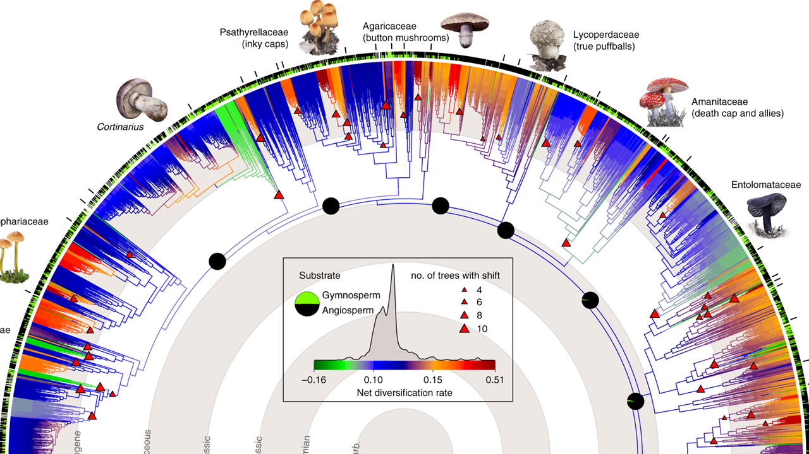

  

Welcome to the **Evolutionary Mycology Team**.

Understanding fungal evolution from genomes to ecosystems, across millions of years of Earth history.

We study the evolution of fungi across deep evolutionary time to understand how they diversified, adapted to changing environments, and evolved the remarkable diversity of forms. We incorporate comparative phylogenetics, genomics, and ecology and explore the possibility of utilising historical collections of millions of dried specimens collected in the last three hundred years.

Currently at the Royal Botanic Gardens, Kew.

---
## News

## Research

Our group focuses on:

- 🍄 Genetics of fruiting body development
- 🧬 Trait evolution and deep evolutionary history of fungi
- 🌍 Building the fungal tree of life
- ⏳ Molecular dating and fossil calibration
- 🏛️ Museomics: Fungarium genomics and historical collections
- 🔬 Fungal taxonomy and biodiversity
- Evolution of medicinal mushrooms
- The diversity of hyphal cords and rhizomorphs

---

## Current Projects

---

## Publications

Full list of publications: https://scholar.google.com/citations?user=5MUWsZwAAAAJ&hl=hu

Selected publications will be added here.

---

## Collaborations

---

## Contact

Email: t.varga@kew.org

Twitter/X: https://x.com/TordaVarga
Bluesky: 
